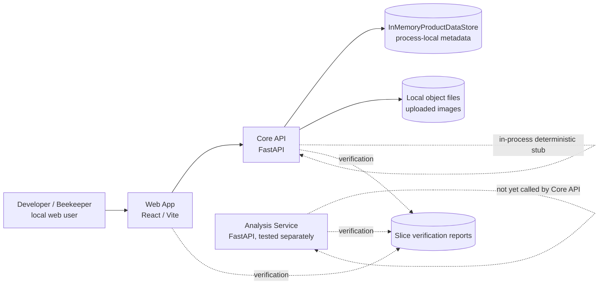

# Current System Architecture

Status: snapshot after Review Remediation 0001 and before Slice 0014 persistence.

## Purpose

This document records where HiveSight is now, not where it is trying to end up. It exists so future slices can compare current implementation reality with the proposed architecture without relying on memory or chat history.

## Snapshot

## Implemented Boundaries

- Web App calls Core API through `CoreApiClient`.
- Core API owns local product workflows, dev authentication, Workspace checks, inspection photo upload, dataset labelling, crop annotation, dataset role assignment, export package construction, Hive Configuration, and deterministic stub analysis projection.
- Analysis Service exists as a separate tested service, but Core API does not yet call it.
- Local image bytes are stored outside metadata records.
- Slice verification can run Core API tests, Analysis Service tests, Web TypeScript checks, and Playwright browser acceptance tests.

## Current Core API Shape

Review Remediation 0001 moved several rule clusters out of the dev store and into workflows:

- `HiveConfigurationWorkflow`
- `TrainingCropWorkflow`
- `TrainingCropDatasetItemWorkflow`

The in-memory store still owns persistence-shaped operations and some remaining workflow-heavy behaviour, especially export/package construction and dev-oriented authorization helpers.

## Current Persistence

The only product metadata persistence is in memory. Records do not survive API restart. This remains acceptable for fast workflow tests and local spikes, but it is no longer acceptable for the Bee Annotation Repository path that feeds model training.

## Current Testing Standard

- API-level acceptance uses Gherkin through pytest-bdd.
- Slice 0030 pilots one client-neutral Gherkin feature through both API and browser bindings.
- Playwright remains the browser-acceptance default for un-migrated workflows; further shared-feature migration is deliberately deferred until the pilot proves its value.

## Known Gaps

- No durable database.
- No database migrations.
- No durable queue.
- No Core API to Analysis Service integration.
- No production auth provider.
- No production object-storage provider or signed URL path.
- No production deployment target.
- No Analysis Store ownership decision.
- Varroa detection remains product/model intent, not implemented capability.
