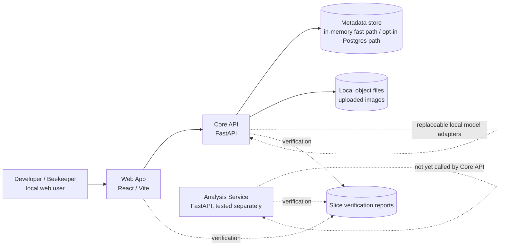

# Current System Architecture

Status: snapshot after Slice 0034 one-click Varroa Photo Analysis workflow.

## Purpose

This document records where HiveSight is now, not where it is trying to end up. It exists so future slices can compare current implementation reality with the proposed architecture without relying on memory or chat history.

## Snapshot

## Implemented Boundaries

- Web App calls Core API through `CoreApiClient`.
- Core API owns local product workflows, dev authentication, Workspace checks, inspection photo upload, dataset labelling, crop annotation, dataset role assignment, export package construction, Hive Configuration, Training Inspection workflow support, and Varroa Photo Analysis evidence.
- Analysis Service exists as a separate tested service, but Core API does not yet call it.
- Varroa Assessment inspections use the Core API product Photo Analysis workflow: `Analyze photo` creates a Varroa Photo Analysis, runs the configured development model-adapter path, persists Inspection Photo Bee Evidence, and exposes photo-level review status.
- Training Data Collection inspections remain separate from product Photo Analysis. Training workflows use Training Crops, Bee Annotation, Crop Governance, Varroa Review, and Model Governance; product Photo Analysis does not create Training Crops or Varroa Review Outcomes.
- Local image bytes are stored outside metadata records.
- Slice verification can run Core API tests, Analysis Service tests, Web TypeScript checks, and Playwright browser acceptance tests.

## Current Core API Shape

Review Remediation 0001 moved several rule clusters out of the dev store and into workflows:

- `HiveConfigurationWorkflow`
- `TrainingCropWorkflow`
- `TrainingCropDatasetItemWorkflow`
- `VarroaPhotoAnalysisWorkflow`

The store still owns persistence-shaped operations and some remaining workflow-heavy behaviour, especially export/package construction and dev-oriented authorization helpers.

## Current Persistence

HiveSight is dual-mode locally. Fast workflow and unit tests still use the in-memory store; durable metadata can run through the opt-in Postgres-backed Core API path introduced for the Bee Annotation Repository and extended by later migrations.

Local Postgres verification is required to fully acceptance-close persistence-dependent slices. The latest generated slice report records the fast verification lane for Slice 0034, but does not record live Postgres verification for migration `0034_product_photo_analysis_evidence.sql`.

## Current Testing Standard

- API-level acceptance uses Gherkin through pytest-bdd.
- Slice 0030 pilots one client-neutral Gherkin feature through both API and browser bindings.
- Playwright remains the browser-acceptance default for un-migrated workflows; further shared-feature migration is deliberately deferred until the pilot proves its value.

## Known Gaps

- Production persistence hardening remains incomplete.
- No durable queue.
- No Core API to Analysis Service integration.
- No production auth provider.
- No production object-storage provider or signed URL path.
- No production deployment target.
- No Analysis Store ownership decision.
- The delivered Varroa Photo Analysis path is deterministic development model evidence, not a production Varroa model, statistically defensible Varroa estimate, Advisor trigger, diagnosis, or treatment recommendation.
