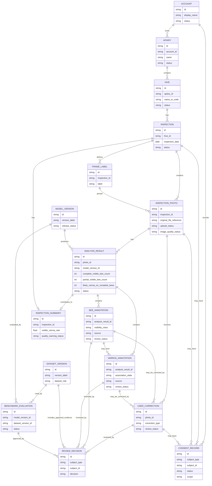

# Domain Model Diagram

This diagram shows the conceptual domain model for BeehiveMonitor. It complements `domain-model.md` and uses the canonical language in `CONTEXT.md`.

## Reading The Diagram

- The left side is the beekeeper workflow: account, apiary, hive, inspection, photos, and analysis.
- The middle is the evidence layer: analysis results, bee annotations, Varroa annotations, summaries, and corrections.
- The lower/right side is model governance: review decisions, consent records, dataset versions, model versions, and benchmark evaluations.
- `Inspection Summary` is derived from photo-level analysis results and should be recalculable.
- `User Correction` is review evidence, not ground truth or training data until consent and review decisions allow it.
