# Domain Model Diagram

This diagram shows the conceptual domain model for HiveSight. It complements `domain-model.md` and uses the canonical language in `CONTEXT.md`.

```mermaid
erDiagram
    USER ||--o{ WORKSPACE_MEMBERSHIP : has
    WORKSPACE ||--o{ WORKSPACE_MEMBERSHIP : grants_access
    WORKSPACE ||--o{ APIARY : owns
    APIARY ||--o{ HIVE : contains
    HIVE ||--o{ INSPECTION : has
    INSPECTION ||--o{ INSPECTION_PHOTO : contains
    INSPECTION ||--o{ FRAME_LABEL : defines
    FRAME_LABEL ||--o{ INSPECTION_PHOTO : groups
    SOURCE_IMAGE ||--o| INSPECTION_PHOTO : plays_role_as
    SOURCE_IMAGE ||--o{ TRAINING_CROP : yields

    INSPECTION_PHOTO ||--o{ ANALYSIS_RESULT : has
    MODEL_VERSION ||--o{ ANALYSIS_RESULT : produces
    ANALYSIS_RESULT ||--o{ BEE_ANNOTATION : contains
    ANALYSIS_RESULT ||--o{ VARROA_ANNOTATION : contains
    BEE_ANNOTATION ||--o{ VARROA_ANNOTATION : may_host
    ANALYSIS_RESULT ||--o| INSPECTION_SUMMARY : contributes_to
    INSPECTION ||--o| INSPECTION_SUMMARY : has

    INSPECTION_PHOTO ||--o{ USER_CORRECTION : receives
    BEE_ANNOTATION ||--o{ USER_CORRECTION : may_be_corrected_by
    VARROA_ANNOTATION ||--o{ USER_CORRECTION : may_be_corrected_by
    USER_CORRECTION ||--o{ REVIEW_DECISION : reviewed_by
    CANDIDATE_ANNOTATION ||--o{ REVIEW_DECISION : reviewed_by
    BEE_ANNOTATION ||--o{ REVIEW_DECISION : reviewed_by
    VARROA_ANNOTATION ||--o{ REVIEW_DECISION : reviewed_by

    WORKSPACE ||--o{ WORKSPACE_DATA_USE_AGREEMENT : accepts
    WORKSPACE ||--o{ DATA_DELETION_REQUEST : may_request

    TRAINING_CROP ||--o{ BEE_ANNOTATION : reviewed_with
    TRAINING_CROP ||--o{ CANDIDATE_ANNOTATION : may_have
    TRAINING_CROP ||--o| DATASET_ITEM : becomes
    SOURCE_IMAGE ||--o{ DATASET_ITEM : sources
    DATASET_ITEM ||--o{ REVIEW_DECISION : may_be_reviewed_by
    DATASET_VERSION ||--o{ DATASET_ITEM : freezes
    DATASET_VERSION ||--o{ TRAINING_RUN : used_by
    TRAINING_RUN ||--o| MODEL_CANDIDATE : produces
    DATASET_VERSION ||--o{ BENCHMARK_EVALUATION : used_by
    MODEL_CANDIDATE ||--o{ BENCHMARK_EVALUATION : evaluated_by
    MODEL_VERSION ||--o{ BENCHMARK_EVALUATION : evaluated_by
    BENCHMARK_EVALUATION ||--o{ REVIEW_DECISION : approved_by

    WORKSPACE {
        string id
        string display_name
        string status
    }

    USER {
        string id
        string display_name
        string contact_identifier
        string status
    }

    WORKSPACE_MEMBERSHIP {
        string id
        string user_id
        string workspace_id
        string role
        string status
    }

    BEEKEEPER_PERSONA {
        string note
        string persisted_entity
        string v1_user_role
    }

    USER ||..|| BEEKEEPER_PERSONA : acts_as

    APIARY {
        string id
        string workspace_id
        string name
        string status
    }

    HIVE {
        string id
        string apiary_id
        string name_or_code
        string status
    }

    INSPECTION {
        string id
        string hive_id
        date inspection_date
        string status
    }

    FRAME_LABEL {
        string id
        string inspection_id
        string label
    }

    INSPECTION_PHOTO {
        string id
        string source_image_id
        string inspection_id
        string upload_status
        string image_quality_status
    }

    SOURCE_IMAGE {
        string id
        string human_readable_id
        string source_type
        string object_key
        string source_group_key
        string permission_status
        string metadata_status
        string status
    }

    TRAINING_CROP {
        string id
        string human_readable_id
        string source_image_id
        string curriculum_stage
        string review_status
    }

    ANALYSIS_RESULT {
        string id
        string photo_id
        string model_version_id
        int complete_visible_bee_count
        int partial_visible_bee_count
        int likely_varroa_on_complete_bees
        string status
    }

    INSPECTION_SUMMARY {
        string id
        string inspection_id
        float visible_varroa_rate
        string quality_warning_status
    }

    BEE_ANNOTATION {
        string id
        string analysis_result_id
        string training_crop_id
        string visibility_class
        string source
        string review_method
        string review_status
    }

    CANDIDATE_ANNOTATION {
        string id
        string source_image_id
        string training_crop_id
        string annotation_type
        string annotation_source
        string status
    }

    VARROA_ANNOTATION {
        string id
        string analysis_result_id
        string association_state
        string source
        string review_status
    }

    USER_CORRECTION {
        string id
        string photo_id
        string correction_type
        string review_status
    }

    REVIEW_DECISION {
        string id
        string subject_type
        string subject_id
        string decision
    }

    WORKSPACE_DATA_USE_AGREEMENT {
        string id
        string workspace_id
        string accepted_by_user_id
        string status
        string terms_version
    }

    DATA_DELETION_REQUEST {
        string id
        string workspace_id
        string status
    }

    MODEL_VERSION {
        string id
        string version_label
        string release_status
    }

    DATASET_VERSION {
        string id
        string human_readable_id
        string model_purpose
        string export_format
        string status
    }

    DATASET_ITEM {
        string id
        string human_readable_id
        string source_image_id
        string training_crop_id
        string dataset_role
        string status
    }

    BENCHMARK_EVALUATION {
        string id
        string model_version_id
        string dataset_version_id
        string status
    }

    TRAINING_RUN {
        string id
        string human_readable_id
        string dataset_version_id
        string model_purpose
        string model_family
        string adapter_type
        string status
    }

    MODEL_CANDIDATE {
        string id
        string human_readable_id
        string model_purpose
        string model_family
        string promotion_status
    }
```

## Reading The Diagram

- The left side is the identity and beekeeper workflow: registered user, workspace membership, workspace, apiary, hive, inspection, photos, and analysis.
- The middle is the evidence layer: analysis results, bee annotations, Varroa annotations, summaries, and corrections.
- The lower/right side is model governance: review decisions, workspace data-use agreements, deletion requests, dataset versions, training runs, model candidates, model versions, and benchmark evaluations.
- `User` is the login identity. `Workspace Membership` grants access to a workspace. `Beekeeper` remains a persona/product actor, not a persisted version-one entity.
- `Source Image` is the underlying image evidence record. `Inspection Photo` is the product-facing role a Source Image plays when attached to an Inspection.
- `Inspection Summary` is derived from photo-level analysis results and should be recalculable.
- `User Correction` is review evidence, not ground truth or training data until the workspace data-use agreement and review decisions allow it.
- `Candidate Annotation` is proposed evidence only. It must be human reviewed before it can become Dataset Item evidence.
- `Dataset Version` freezes reviewed Dataset Item evidence before a Training Run or Benchmark Evaluation consumes it.
- Slice 0015 trains Bee Detector Model Candidates only. Varroa Detector training and user-facing Model Versions remain future work.
