# HiveSight Model Pipeline Overview

Status: current planning view after Slice 0015.4 governance updates.

## Purpose

This diagram replaces the earlier simple two-stage "bee detection then Varroa detection" picture with the current HiveSight model architecture.

The important changes are:

- Bee Localisation, Bee Orientation, and Varroa Detection are separate logical model purposes.
- The current YOLO OBB work is Bee Localisation only.
- Human-reviewed evidence, Dataset Versions, Benchmark Evaluations, and governance gates are first-class parts of the system.
- Public/open evidence and external contributor work cannot silently flow into training, evaluation, deployment, sharing, publication, or commercial use.
- User-facing Varroa assessment is future capability and must pass both model-purpose benchmarks and an end-to-end pipeline evaluation.

## Overview Diagram

```mermaid
flowchart LR
    classDef input fill:#e8f1ff,stroke:#1d5fa7,stroke-width:1px,color:#102a43
    classDef curate fill:#ecfdf3,stroke:#27845b,stroke-width:1px,color:#143d2b
    classDef model fill:#fff4e6,stroke:#c96b12,stroke-width:1px,color:#4a2706
    classDef future fill:#f3ecff,stroke:#7650b8,stroke-width:1px,color:#29124d
    classDef gate fill:#fff8db,stroke:#b28b00,stroke-width:1px,color:#3d3100
    classDef store fill:#eef2f7,stroke:#52606d,stroke-width:1px,color:#1f2933
    classDef danger fill:#ffeaea,stroke:#b42318,stroke-width:1px,color:#5f1b13

    subgraph evidence["Governed Evidence Intake"]
        source["Source Images<br/>Inspection photos, project imports,<br/>public/open datasets"]:::input
        rights["Source Rights Record<br/>licence, attribution,<br/>permitted use scopes"]:::gate
        consent["Workspace Data Use Agreement<br/>and Contributor Contribution Permission"]:::gate
        crop["Training Crops<br/>small to full-frame curriculum"]:::curate
        ellipse["Human-reviewed<br/>directed bee ellipses<br/>complete / partial / uncertain"]:::curate
        repo["Bee Annotation Repository<br/>Dataset Items with role,<br/>source group, hive context"]:::store
    end

    source --> rights
    source --> consent
    rights --> crop
    consent --> crop
    crop --> ellipse
    ellipse --> repo

    subgraph dataset["Dataset Governance"]
        roles["Dataset Roles<br/>training / validation / benchmark / excluded"]:::curate
        version["Dataset Version<br/>frozen reviewed evidence"]:::store
        benchmark["Protected Benchmark Evidence<br/>frozen before evaluated candidate"]:::gate
        scope["Scope Compatibility Check<br/>development, evaluation,<br/>deployment, sharing, commercial"]:::gate
    end

    repo --> roles
    roles --> version
    roles --> benchmark
    version --> scope
    benchmark --> scope

    subgraph training["Current Model Work"]
        train["YOLO OBB Training Baseline<br/>Bee Localisation only"]:::model
        candidate["Model Candidate<br/>not user-facing"]:::model
        eval["Slice 0015.4<br/>Benchmark Evaluation Report<br/>precision / recall / warnings"]:::model
    end

    scope --> train
    train --> candidate
    candidate --> eval
    benchmark --> eval

    subgraph future_pipeline["Future User-Facing Varroa Pipeline"]
        inspect["Varroa Assessment Inspection<br/>multi-photo frame evidence"]:::input
        localise["1. Bee Localisation<br/>find visible bees<br/>and body geometry"]:::model
        orient["2. Bee Orientation<br/>predict head direction<br/>or mark unreliable"]:::future
        bee_crop["Head-normalized<br/>bee-relative crop"]:::future
        varroa["3. Varroa Detection<br/>visible mite point or tight box"]:::future
        result["Result Evidence Breakdown<br/>positive / active negative<br/>not determined / unassessed"]:::future
        rate["Visible Varroa Rate<br/>with coverage warning<br/>or suppression"]:::future
    end

    inspect --> localise
    localise --> orient
    orient --> bee_crop
    bee_crop --> varroa
    varroa --> result
    result --> rate

    subgraph recovery["Human Review And Feedback"]
        recovery_review["Inspection Recovery Review<br/>saveable, resumable,<br/>AI-assisted-reviewed"]:::curate
        contribution["Dataset Contribution Decision<br/>per completed result revision"]:::gate
        curator["Dataset Curator Review<br/>not automatic training data"]:::curate
    end

    rate -. inadequate coverage .-> recovery_review
    recovery_review --> contribution
    contribution --> curator
    curator --> repo

    subgraph governance["Cross-Cutting Governance"]
        postgres[("Postgres<br/>product and model-governance metadata")]:::store
        object_store[("Object Storage Adapter<br/>images, exports, model artifacts")]:::store
        attribution["Attribution And Provenance<br/>travels with versions,<br/>exports and reports"]:::gate
        withdrawal["Withdrawal / Rights Invalidation<br/>quarantine affected artifacts<br/>and retrain clean replacement"]:::danger
        qa["Verification<br/>API tests, BDD, Playwright,<br/>live Postgres checks"]:::store
    end

    repo -. persisted in .-> postgres
    version -. persisted in .-> postgres
    eval -. report metadata .-> postgres
    source -. bytes .-> object_store
    train -. artifacts .-> object_store
    eval -. artifacts .-> object_store
    rights --> attribution
    eval --> attribution
    consent -. withdrawal .-> withdrawal
    rights -. invalidated .-> withdrawal
    withdrawal -. excludes .-> repo
    withdrawal -. quarantines .-> version
    withdrawal -. quarantines .-> candidate
    qa -. verifies .-> evidence
    qa -. verifies .-> training
```

## Reading Notes

- The current trainable model path is the middle section: reviewed bee ellipses become Dataset Items, Dataset Versions, YOLO OBB Bee Localisation Training Runs, Model Candidates, and Benchmark Evaluation reports.
- YOLO OBB geometry is body localisation. It does not prove bee head direction.
- Bee Orientation is a separate future model purpose. Human-directed ellipses provide the first source of orientation evidence.
- Varroa Detection is also separate. It should work on head-normalized bee crops where orientation is reliable.
- Benchmark Evaluation is an `evaluation` use and must respect Source Rights Records, Contributor Contribution Permissions, permitted-use scopes, attribution, withdrawal, and rights invalidation.
- Recovery feedback from beekeeper-facing inspections is product evidence first. It enters model data only after an explicit Dataset Contribution Decision and independent Dataset Curator review.

## Differences From Earlier Diagram

The earlier diagram implied a direct two-stage pipeline:

`Frame photo -> Bee detection -> Bee extraction -> Varroa detection -> statistical inference -> result`

The current architecture is more careful:

`Governed evidence -> human-reviewed datasets -> Bee Localisation candidate -> benchmark report -> future Bee Orientation -> future Varroa Detection -> future inspected result with coverage gates`

The statistical infestation estimate is no longer shown as a simple final box because HiveSight has not yet designed or implemented the inspection-rate sampling model. The current product term remains Visible Varroa Rate, with explicit warnings or suppression when evidence coverage is inadequate.
