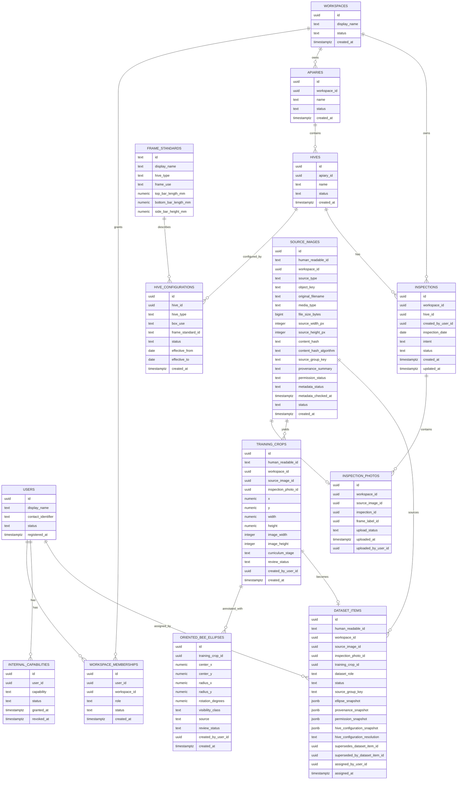

# Postgres Persistence Design

Status: proposed design for Vertical Slice 0014.

## Purpose

Define the first durable metadata shape for HiveSight before Slice 0014 implementation starts.

This design deliberately covers the Bee Annotation Repository path only. It is not the final HiveSight schema.

## Persistence Principles

- Keep domain and workflow rules in workflows or policy services.
- Keep repositories persistence-shaped: load, save, find, list, exists, delete where needed.
- Use database constraints for tenant ownership, uniqueness, referential integrity, idempotency, and concurrency-sensitive invariants.
- Preserve provenance and reviewed-evidence snapshots where later model training depends on historical meaning.
- Keep image bytes and generated files outside Postgres.
- Add migrations from the first durable schema.
- Keep in-memory adapters for fast workflow/unit tests.
- Move API-level BDD and browser acceptance to Postgres-backed persistence once Slice 0014 lands.

## Domain Stability Classification

### Stable Records For Slice 0014

These are stable enough to persist directly:

- User
- Workspace
- Workspace Membership
- Internal Capability
- Apiary
- Hive
- Hive Configuration
- Frame Standard seed data
- Inspection
- Source Image metadata and object key
- Inspection Photo context
- Training Crop
- Oriented Bee Ellipse
- Dataset Item

### Version Or History-Sensitive Records

These require snapshots or provenance because later interpretation may change:

- Dataset Item ellipse snapshot
- Dataset Item provenance snapshot
- Hive Configuration known at source-image capture or review time
- Workspace Data Use Agreement status relevant to dataset eligibility
- Dataset Role assignment actor and timestamp
- Source Image provenance and permission status
- Source Image metadata minimisation status
- Dataset Item supersession links and immutable evidence posture

### Volatile Or Deferred Records

These stay out of Slice 0014:

- Analysis Result persistence changes
- Varroa Annotation training records
- raw EXIF or image metadata
- automatic consent withdrawal/deletion propagation
- Training Run
- Model Candidate
- Model Version
- Benchmark Evaluation
- Analysis Service-owned result store records
- production auth provider identities
- durable queue messages
- deployment/runtime operation records

## Proposed Slice 0014 ER Diagram

## Constraints And Indexes

Slice 0014 should include constraints for:

- one active owner membership per seeded Workspace/User pair where applicable
- active Internal Capability uniqueness per User/capability
- immutable generated human-readable ids for Source Image, Training Crop, and Dataset Item, unique as full prefixed strings
- Hive Configuration frame standard references
- one active Hive Configuration per Hive
- Hive Configuration values include `effective_from` and `effective_to`
- Inspection intent values
- Inspection creation requires an active Hive Configuration through workflow rules
- Source Image source type values, with only `inspection_photo` implemented in Slice 0014
- Source Image `workspace_id` required for `inspection_photo` source type
- Source Image status values: `accepted`, `rejected`, `archived`
- accepted Source Images require dimensions, `content_hash`, and `content_hash_algorithm`
- Source Image stores metadata minimisation status only; raw EXIF/image metadata is not stored in Postgres
- Inspection Photo references one Source Image
- Training Crop bounds and dimensions greater than zero
- Training Crop `workspace_id` matches the Source Image workspace for Slice 0014
- Oriented Bee Ellipse radii greater than zero
- one Dataset Item per Training Crop
- Dataset Item `workspace_id` matches the Source Image workspace for Slice 0014
- Dataset Item statuses: `active`, `superseded`, `withdrawn`
- Dataset Item snapshots permission, provenance, reviewed ellipses, and resolved Hive Configuration
- Benchmark Dataset Items require `source_group_key`
- hard block benchmark leakage conflicts for the same Source Image or same `source_group_key` across benchmark versus training/validation
- allow training and validation to share `source_group_key` in Slice 0014, but export/reporting must flag it as a leakage warning
- valid Dataset Role values: `training`, `validation`, `benchmark`, `excluded`

Tenant queries should index Workspace ownership paths, especially Inspection Photo and Inspection lookup by Workspace.

## Migration Strategy

Recommendation: use Alembic unless implementation context reveals a stronger repo-local reason not to.

Slice 0014 should add:

- first migration creating the narrow schema
- seed/reset command for local and test development
- deterministic dev personas and Internal Capabilities as seed data, not production migration data
- repository integration tests against Postgres

## Transaction Boundaries

The likely transaction boundaries are:

- user/workspace/dev persona seed reset
- apiary/hive/Hive Configuration setup
- inspection creation with mandatory Hive Configuration gate
- Source Image and Inspection Photo metadata creation
- Training Crop creation or update
- reviewed ellipse save
- Dataset Item assignment with ellipse and provenance snapshots

Dataset Item assignment should be atomic: either the role assignment, ellipse snapshot, provenance snapshot, permission snapshot, Hive Configuration snapshot, supersession shape, and leakage checks are all stored, or none are.

## Open Implementation Questions For Slice 0014

- Whether to use one shared test database with schema reset or per-test temporary schemas.
- Whether repository protocols should be introduced all at once or only around the first Postgres-backed workflows.
- Whether the first migration stores Frame Standards as seed data or as ordinary managed metadata with a seed script.
