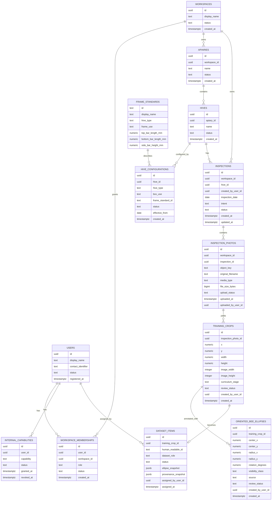

# Postgres Persistence Design

Status: proposed design for Vertical Slice 0014.

## Purpose

Define the first durable metadata shape for HiveSight before Slice 0014 implementation starts.

This design deliberately covers the Bee Annotation Repository path only. It is not the final HiveSight schema.

## Persistence Principles

- Keep domain and workflow rules in workflows or policy services.
- Keep repositories persistence-shaped: load, save, find, list, exists, delete where needed.
- Use database constraints for tenant ownership, uniqueness, referential integrity, idempotency, and concurrency-sensitive invariants.
- Preserve provenance and reviewed-evidence snapshots where later model training depends on historical meaning.
- Keep image bytes and generated files outside Postgres.
- Add migrations from the first durable schema.
- Keep in-memory adapters for fast workflow/unit tests.
- Move API-level BDD and browser acceptance to Postgres-backed persistence once Slice 0014 lands.

## Domain Stability Classification

### Stable Records For Slice 0014

These are stable enough to persist directly:

- User
- Workspace
- Workspace Membership
- Internal Capability
- Apiary
- Hive
- Hive Configuration
- Frame Standard seed data
- Inspection
- Inspection Photo metadata and object key
- Training Crop
- Oriented Bee Ellipse
- Dataset Item

### Version Or History-Sensitive Records

These require snapshots or provenance because later interpretation may change:

- Dataset Item ellipse snapshot
- Dataset Item provenance snapshot
- Hive Configuration known at source-photo capture or review time
- Workspace Data Use Agreement status relevant to dataset eligibility
- Dataset Role assignment actor and timestamp

### Volatile Or Deferred Records

These stay out of Slice 0014:

- Analysis Result persistence changes
- Varroa Annotation training records
- Training Run
- Model Candidate
- Model Version
- Benchmark Evaluation
- Analysis Service-owned result store records
- production auth provider identities
- durable queue messages
- deployment/runtime operation records

## Proposed Slice 0014 ER Diagram

## Constraints And Indexes

Slice 0014 should include constraints for:

- one active owner membership per seeded Workspace/User pair where applicable
- active Internal Capability uniqueness per User/capability
- Hive Configuration frame standard references
- Inspection intent values
- Training Crop bounds and dimensions greater than zero
- Oriented Bee Ellipse radii greater than zero
- one Dataset Item per Training Crop
- unique human-readable Dataset Item identifier
- valid Dataset Role values: `training`, `validation`, `benchmark`, `excluded`

Tenant queries should index Workspace ownership paths, especially Inspection Photo and Inspection lookup by Workspace.

## Migration Strategy

Recommendation: use Alembic unless implementation context reveals a stronger repo-local reason not to.

Slice 0014 should add:

- first migration creating the narrow schema
- seed/reset command for local and test development
- deterministic dev personas and Internal Capabilities as seed data, not production migration data
- repository integration tests against Postgres

## Transaction Boundaries

The likely transaction boundaries are:

- user/workspace/dev persona seed reset
- apiary/hive/Hive Configuration setup
- inspection creation with mandatory Hive Configuration gate
- inspection photo metadata creation
- Training Crop creation or update
- reviewed ellipse save
- Dataset Item assignment with ellipse and provenance snapshots

Dataset Item assignment should be atomic: either the role assignment, ellipse snapshot, and provenance snapshot are all stored, or none are.

## Open Implementation Questions For Slice 0014

- Whether to use one shared test database with schema reset or per-test temporary schemas.
- Whether repository protocols should be introduced all at once or only around the first Postgres-backed workflows.
- Whether the first migration stores Frame Standards as seed data or as ordinary managed metadata with a seed script.

