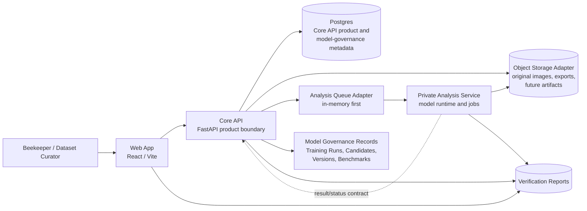

# Proposed System Architecture

Status: target architecture for the next tranche after Slice 0013.

## Purpose

This document records the near-term target architecture created by Slice 0013. It does not describe a production deployment. It describes the shape HiveSight should move toward through Slice 0014 persistence, later Analysis Service integration, and the first YOLO OBB training baseline.

## Proposed Shape

## Near-Term Delivery Order

1. Slice 0014 introduces Postgres-backed Bee Annotation Repository metadata persistence.
2. Slice 0015 may then proceed with YOLO OBB Training Baseline using durable reviewed evidence.
3. Core API to Analysis Service integration can proceed through the async workflow shape recorded in ADR 0004 when model-runtime integration becomes load-bearing.
4. Dev persona switcher remains a separate dev-only slice, likely after Slice 0014 and before the next role-specific UI acceptance flow.

## Accepted Decisions

- Postgres is the durable metadata store for Core API product and model-governance metadata.
- Image bytes, dataset package files, and model artifacts remain outside Postgres.
- Analysis Service stays separate and private.
- The first Analysis Service integration uses an in-memory queue adapter before durable queue technology is chosen.
- Client-neutral Gherkin is the acceptance BDD path. Slice 0030 pilots the same canonical feature through API and browser bindings; direct Playwright remains the browser-acceptance default for un-migrated workflows.

## Deferred Decisions

- Production auth provider.
- Durable queue technology.
- Production object-storage provider.
- Deployment platform.
- Analysis Store physical ownership.
- Signed upload/view URL implementation.
- Capability-by-capability migration into the shared Gherkin catalogue after Slice 0030.
- Security, contract-governance, and release-readiness skills until their parked triggers occur.

## Known Gaps

- Slice 0014 must prove migrations, seed/reset commands, and Postgres-backed acceptance tests.
- Slice 0015 must add durable Training Run and Model Candidate records if it proceeds.
- Varroa-specific model and annotation slices must not start until traceability clearly distinguishes implemented bee-detector foundations from future Varroa capability.
- The proposed architecture still needs a production deployment view once external access becomes real.
