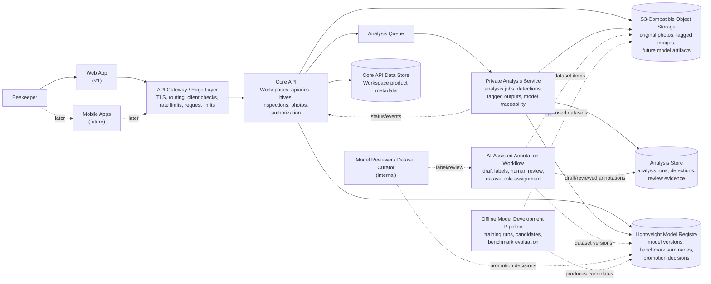

# System Context

This document shows the first HiveSight system boundary. It is intentionally higher level than a deployment diagram: it names the actors, applications, services, stores, and trust boundaries needed to support the V1 architecture.

## Context

HiveSight is a Varroa-focused inspection support system for hobbyist and small-scale beekeepers. Version one is web-first, but the backend must be suitable for future Android and Apple applications.

The Core API is the product-facing service boundary. It owns Workspace-scoped product data and authorization decisions. The Analysis Service is private and owns analysis execution, detailed model outputs, tagged analysis artifacts, and model-version traceability. Image analysis is asynchronous.

## Diagram

## Boundaries

### User And Client Boundary

The Web App and future Mobile Apps call the Core API through the API Gateway or edge layer. The Core API is internet-reachable but protected. User-facing operations require an authenticated user context and Workspace authorization. Client/application checks, allowed origins or redirect URIs, scopes, rate limits, and request limits belong at the gateway and API boundary.

Browser and mobile clients must not depend on embedded long-lived secrets. True service-to-service credentials are reserved for trusted backend integrations.

### Product Boundary

The Core API owns the beekeeper-facing workflow:

- Workspace
- Workspace Data Use Agreement state
- Apiary
- Hive
- Inspection
- Frame Label
- Inspection Photo metadata
- user-facing analysis status and summaries
- authorization decisions

The frontend should not call storage or analysis services directly except through short-lived, scoped URLs issued after Core API authorization.

### Analysis Boundary

The Analysis Service is private. It receives work through the queue or trusted service calls, reads source photos through controlled storage access, writes detailed analysis outputs to the Analysis Store, and records the Model Version used for each Analysis Result.

One Inspection Photo can have multiple analysis runs. Older runs are preserved. Re-analysis with a newer model is a deliberate action, not an automatic overwrite.

### Storage Boundary

Original photos and generated tagged images live in S3-compatible object storage. The target pattern is:

- short-lived, single-object upload URLs
- short-lived, single-object download or view URLs
- no permanent public photo URLs
- no broad client-side storage credentials

A local prototype may proxy image upload or delivery through the Core API, but the service contract should keep the signed-URL target visible.

### Model Governance Boundary

The runtime system, AI-assisted annotation workflow, and offline model-development pipeline are separate concerns. Runtime services run approved model versions and capture evidence. The annotation workflow may use AI-assisted Draft Annotations to accelerate labelling, but human review is required before annotations become trusted reviewed evidence. The model-development pipeline curates Dataset Items, creates Dataset Versions, runs Training Runs, evaluates Model Candidates against protected benchmarks, and promotes Model Versions through human approval.

The main V1 web UI should focus on the beekeeper product workflow. Model governance and review can be handled through internal/manual workflows first, while preserving the backend concepts needed for later tooling.

## Open Architecture Questions

- Which authentication provider or identity approach should be used first?
- Which queue technology should be used locally and in production?
- Which database should back the Core API and Analysis Store?
- Should the Analysis Store start as separate tables in one local database, or as a physically separate database from day one?
- Which S3-compatible storage provider should be used beyond local MinIO?
- What exact upload size and image format limits should the edge layer enforce?
- What deployment platform should host the first production-like environment?
